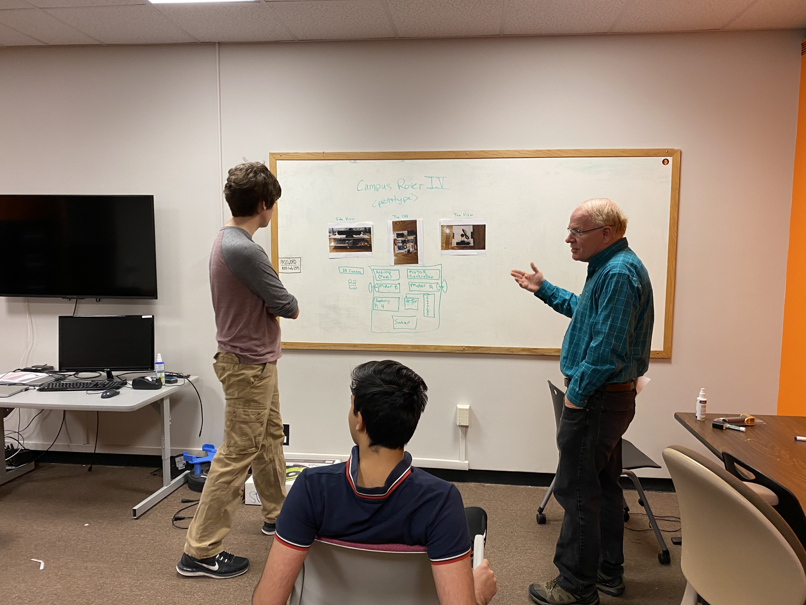
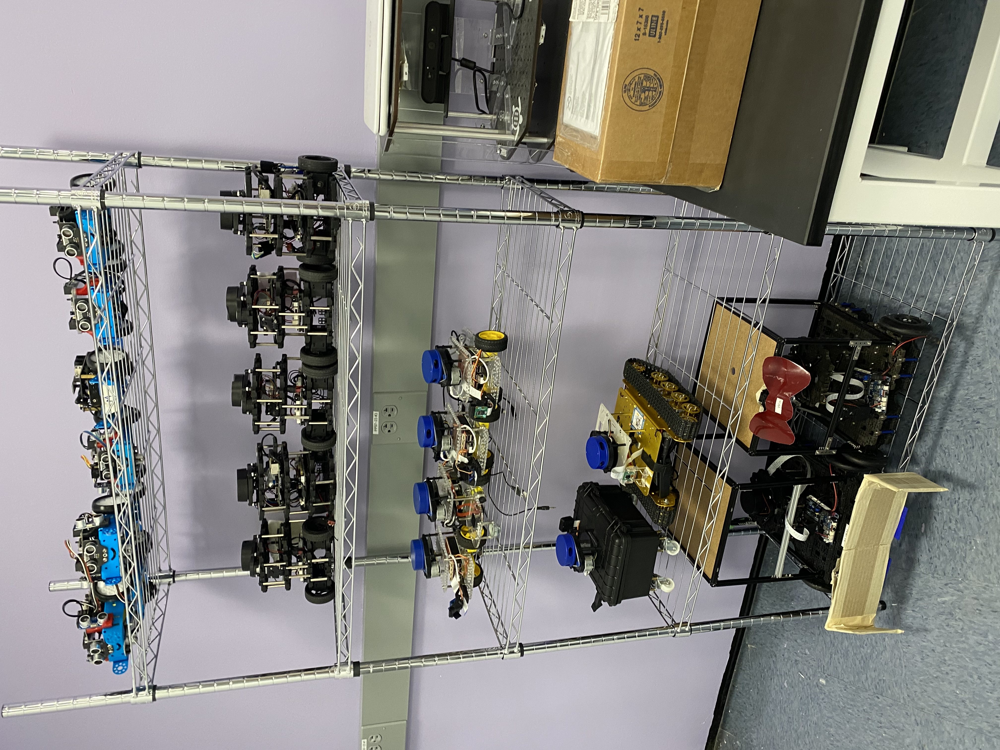
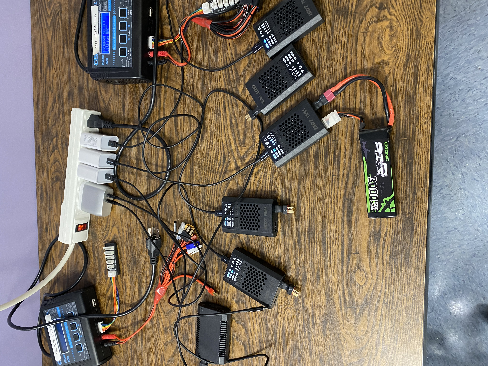
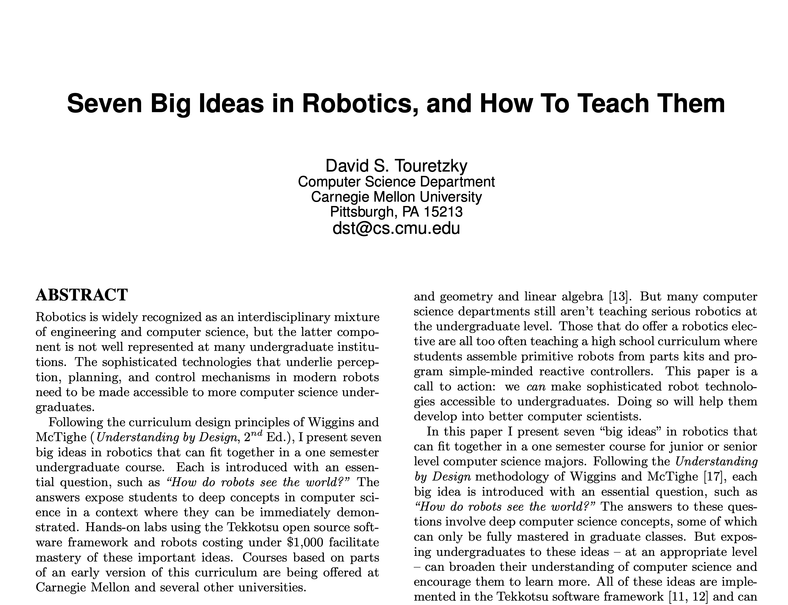
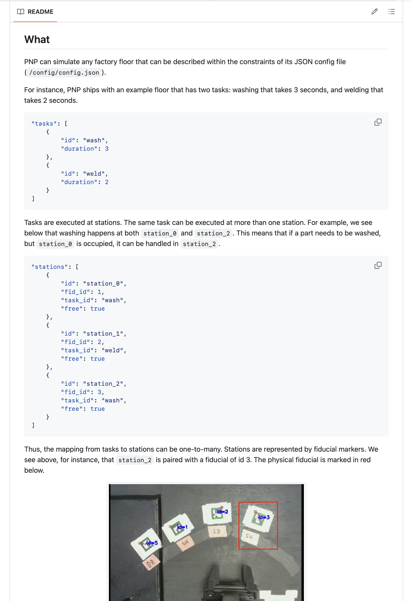
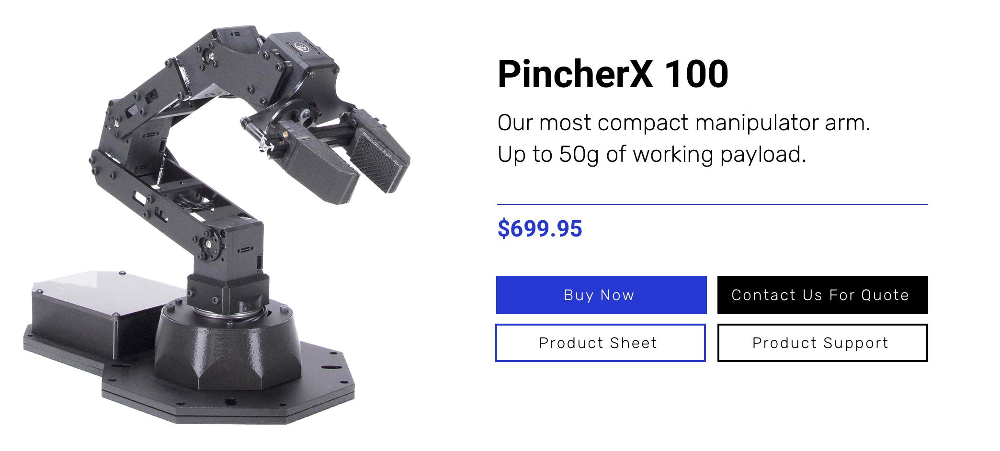
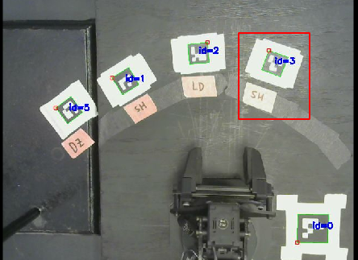
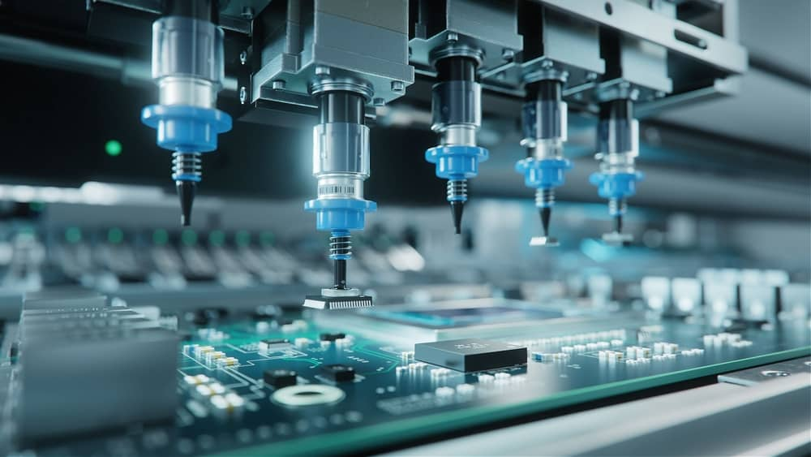

footer: Pito Salas - Brandeis University 2024
slidenumbers: true

## Brandeis Robotics

### May 28-29 2024
### Pito Salas

---
## The Teaching Lab
* Capacity around 20 students (packed)
    

---

## Teaching Lab

[.column]

* Staff:
    * Pito Salas (me)
    * Charlie Squires ("Roboticist In residence")

[.column]

---
[.column]

## Our Robot Gallery

* Robots (Some commercial and some home grown)

[.column]

---

## WHy home grown?

[.column]

[.column]

* Learning/teaching how they work
* Cost
* Outdoor capable
* Customizability

[.column]

---

## What else we have

[.column]
* Lots of parts, tools, devices

[.column]

---
## **Course:** Cosi 119a Autonomous Robotics

[.column]
* Structured around "Seven Big Ideas" paper
* An *applied computer science* course
* Theory + Programming assignments + Term Project
* Ever growing scaffolding

[.column]

---

## Current Projects

* Next Generation *BranBot*
* Arm Pick and Place

---

## BranBot

[.column]

* Outdoor capable
* "Kitified"
* Low cost (~$500)

[.column]

---

## Pick-and-place

[.column]

* Robot Arm Control
* Creating new scaffolding for students
* One of the classic robotics and automation challenges
* "A general pick-and-place implementation using inexpensive robotic arms"

[.column]

---

## Challenges

[.column]

[.column]

1. The least expensive-non-toy Robot arm we could find
1. Four degrees of freedom

---
## Overview

[.column]

1. Target "payloads" have to be layed out in a semi-circle
1. Identified by fiducials

[.column]

---

## Controlling the factory floor

[.column]

[.column]

* Cargos, Stations, Processes
* e.g. 
    1. Cargo "bracket" requires Process "weld"
    1. Station "welder-1" can perform Process "weld"
    1. Process "weld" requires 80

---

## Demo

---

# End